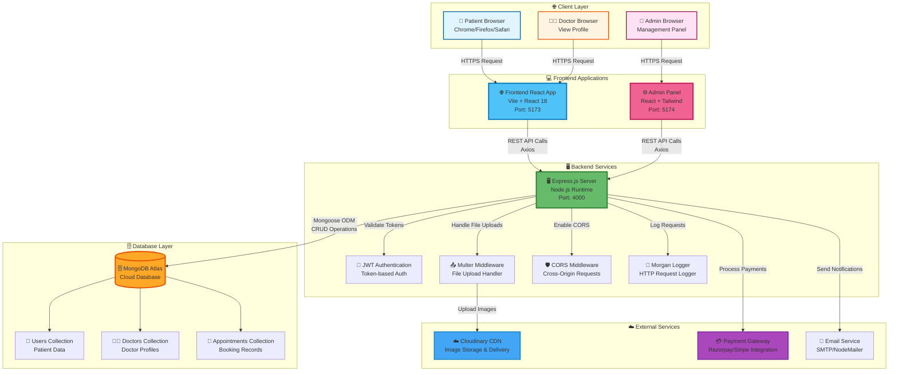
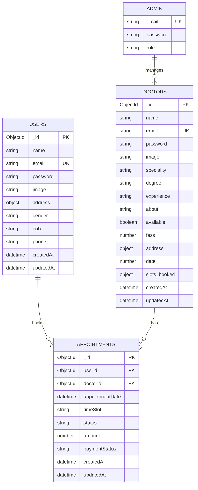
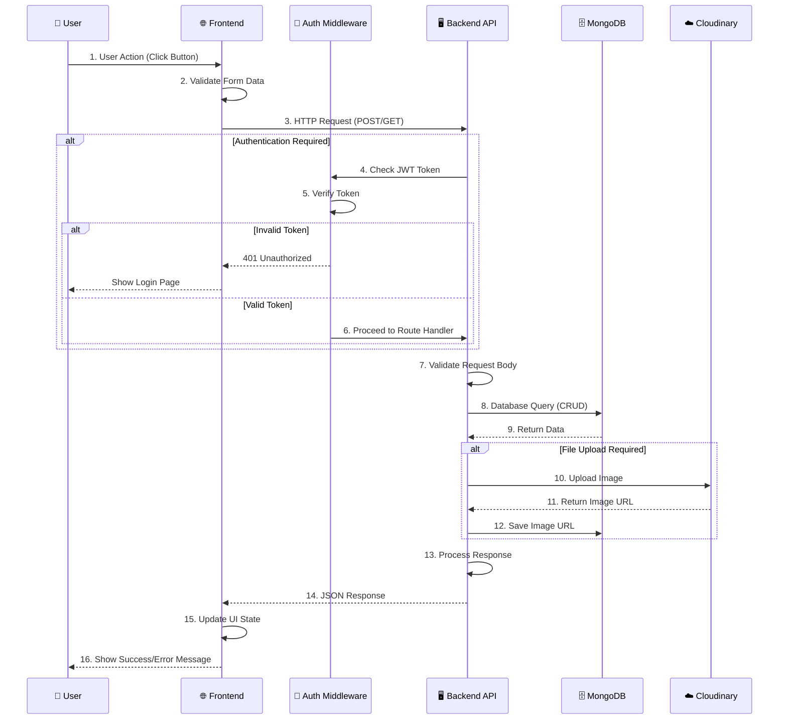
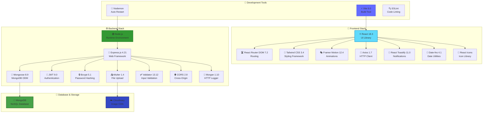
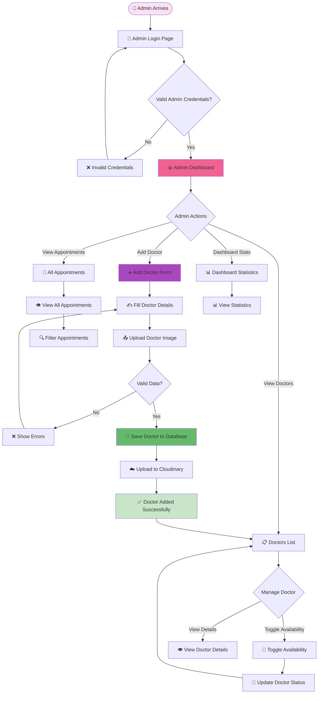

# 🏥 CareSlotter - Doctor Appointment Booking System

<div align="center">


**A modern, full-stack web application for booking doctor appointments seamlessly**

[](https://care-slotter-doctor-appointment.onrender.com/)
[](https://reactjs.org/)
[](https://nodejs.org/)
[](https://www.mongodb.com/)
[](https://tailwindcss.com/)

</div>

---

## 📋 Table of Contents

- [✨ Features](#-features)
- [🚀 Live Demo](#-live-demo)
- [🏗️ Architecture](#️-architecture)
- [👤 User Flow](#-user-flow)
- [🛠️ Tech Stack](#️-tech-stack)
- [📁 Project Structure](#-project-structure)
- [⚙️ Installation](#️-installation)
- [🔌 API Endpoints](#-api-endpoints)
- [🎨 Features Overview](#-features-overview)
- [📸 Screenshots](#-screenshots)
- [🤝 Contributing](#-contributing)
- [📝 License](#-license)

---

## 🌟 Key Highlights

<div align="center">

### 🎯 **Why CareSlotter?**

| 🚀 Performance | 🔒 Security | 📱 Responsive | ⚡ Modern |
|:---:|:---:|:---:|:---:|
| Fast loading with Vite | JWT Authentication | Mobile-first design | Latest React 18 |
| Optimized bundles | Bcrypt password hashing | Tablet support | Modern ES6+ |
| Code splitting | Secure API endpoints | Desktop optimized | TypeScript ready |

</div>

### 💡 **Standout Features**

- 🎨 **Beautiful UI/UX** - Modern design with Tailwind CSS and smooth animations
- ⚡ **Lightning Fast** - Optimized performance with Vite and React 18
- 🔒 **Secure** - JWT authentication, password hashing, and secure API endpoints
- 📱 **Fully Responsive** - Works perfectly on mobile, tablet, and desktop
- 🏥 **Comprehensive** - Complete solution for appointment booking
- 👥 **Multi-Role** - Separate interfaces for patients, doctors, and admins
- ☁️ **Cloud-Ready** - MongoDB Atlas and Cloudinary integration
- 🚀 **Production-Ready** - Deployed and live on Render

---

## ✨ Features

### 👥 For Patients
- 🔐 **User Authentication** - Secure sign up and login
- 🔍 **Doctor Search** - Browse doctors by specialty
- 📅 **Appointment Booking** - Book appointments with available time slots
- 👤 **Profile Management** - Update personal information
- 📋 **Appointment History** - View and manage appointments
- 💳 **Online Payment** - Secure payment integration ready
- 📱 **Responsive Design** - Works seamlessly on all devices

### 👨‍⚕️ For Doctors
- 📊 **Doctor Profiles** - Detailed doctor information with specialties
- ⏰ **Availability Management** - Set and manage available time slots
- 💰 **Fee Management** - Set consultation fees
- 📝 **Professional Details** - Showcase qualifications and experience

### 🔧 For Administrators
- ➕ **Add Doctors** - Add new doctors to the platform
- 📋 **Manage Appointments** - View and manage all appointments
- 👥 **Doctor Management** - Enable/disable doctor availability
- 📊 **Dashboard** - Overview of platform statistics
- 🔒 **Secure Admin Panel** - Protected admin routes

---

## 🚀 Live Demo

### 🌐 **Live Application**
👉 **[Visit CareSlotter](https://care-slotter-doctor-appointment.onrender.com/)**

Experience the full application with all features enabled!

---

## 🏗️ Architecture

### 🎯 System Architecture Overview



### 📊 Database Schema Architecture



### 🔄 API Request/Response Flow



### 🛠️ Technology Stack Architecture



---

## 👤 User Flow

### 🎭 Complete End-to-End User Journey (Stickman Perspective)

```mermaid
journey
    title 👤 Patient Complete Journey: From Landing to Appointment Management
    section 🌐 Landing & Discovery
      👤 User opens browser: 5: 👤
      👤 Types website URL: 4: 👤
      👤 Arrives at homepage: 5: 👤
      👤 Sees hero banner: 4: 👤
      👤 Browses featured doctors: 5: 👤
      👤 Views specialty categories: 4: 👤
    section 🔍 Search & Exploration
      👤 Clicks on Doctors menu: 4: 👤
      👤 Sees all doctors list: 5: 👤
      👤 Filters by specialty: 5: 👤
      👤 Scrolls through doctor cards: 4: 👤
      👤 Clicks on doctor card: 5: 👤
      👤 Views doctor profile page: 5: 👤
      👤 Reads doctor qualifications: 4: 👤
      👤 Checks doctor experience: 4: 👤
      👤 Views consultation fees: 5: 👤
      👤 Sees doctor availability: 5: 👤
    section 🔐 Authentication Flow
      👤 Clicks Book Appointment: 4: 👤
      👤 Redirected to Login page: 3: 👤
      👤 Chooses Sign Up option: 3: 👤
      👤 Fills name field: 3: 👤
      👤 Fills email field: 3: 👤
      👤 Creates password: 3: 👤
      👤 Submits registration form: 4: 👤
      👤 Account created successfully: 5: 👤
      👤 Auto-logged in: 5: 👤
    section 📅 Booking Process
      👤 Returns to doctor profile: 4: 👤
      👤 Sees available time slots: 5: 👤
      👤 Views calendar with dates: 5: 👤
      👤 Selects preferred date: 5: 👤
      👤 Sees available times for date: 5: 👤
      👤 Selects time slot: 5: 👤
      👤 Reviews appointment details: 4: 👤
      👤 Confirms booking: 5: 👤
    section 💳 Payment & Confirmation
      👤 Redirected to payment: 3: 👤
      👤 Enters payment details: 3: 👤
      👤 Completes payment: 4: 👤
      👤 Payment processed: 5: 👤
      👤 Sees confirmation message: 5: 👤
      👤 Receives confirmation email: 4: 👤
    section 📋 Post-Booking Management
      👤 Navigates to My Appointments: 5: 👤
      👤 Views appointment list: 5: 👤
      👤 Sees appointment details: 4: 👤
      👤 Checks appointment status: 4: 👤
      👤 Views doctor information: 4: 👤
      👤 Sees appointment date/time: 5: 👤
    section 👤 Profile Management
      👤 Clicks on My Profile: 4: 👤
      👤 Views profile information: 4: 👤
      👤 Edits personal details: 3: 👤
      👤 Updates profile picture: 3: 👤
      👤 Saves changes: 4: 👤
    section 🔄 Additional Actions
      👤 Books another appointment: 4: 👤
      👤 Cancels an appointment: 3: 👤
      👤 Views appointment history: 4: 👤
      👤 Logs out: 3: 👤
```

### 🗺️ Detailed End-to-End User Flow Diagram

```mermaid
flowchart TB
    Start([👤 User Opens Browser<br/>Types URL]) --> Home[🏠 Homepage<br/>Hero Section & Featured Doctors]
    
    Home --> NavChoice{👤 Navigation Choice}
    NavChoice -->|Browse Doctors| DoctorsPage[👨‍⚕️ Doctors Page<br/>All Doctors List]
    NavChoice -->|View Specialties| Specialties[🏥 Specialties Page<br/>Medical Categories]
    NavChoice -->|About| About[ℹ️ About Page<br/>Platform Information]
    NavChoice -->|Contact| Contact[📞 Contact Page<br/>Get in Touch]
    NavChoice -->|Services| Services[🩺 Services Page<br/>Our Services]
    
    Specialties --> SpecialtyList[📋 Specialty List<br/>Cardiologist, Neurologist, etc.]
    SpecialtyList --> FilterBySpecialty[🔍 Filter Doctors<br/>By Selected Specialty]
    FilterBySpecialty --> DoctorsPage
    
    DoctorsPage --> SearchBar[🔎 Search Bar<br/>Search by Name/Specialty]
    SearchBar --> FilteredList[📋 Filtered Doctor List<br/>Matching Results]
    FilteredList --> DoctorCard[👤 Clicks Doctor Card<br/>Views Doctor Info]
    
    DoctorCard --> DocProfile[👨‍⚕️ Doctor Profile Page<br/>Full Details]
    DocProfile --> DocInfo{👤 Views Information}
    DocInfo -->|Qualifications| Qualifications[🎓 Qualifications<br/>Degree & Experience]
    DocInfo -->|Specialty| SpecialtyInfo[🏥 Specialty Details<br/>Area of Expertise]
    DocInfo -->|Fees| FeeInfo[💰 Consultation Fees<br/>Pricing Information]
    DocInfo -->|Location| LocationInfo[📍 Address<br/>Clinic Location]
    DocInfo -->|Availability| AvailabilityInfo[⏰ Available Slots<br/>Time Availability]
    
    Qualifications --> BookBtn[📅 Book Appointment Button]
    SpecialtyInfo --> BookBtn
    FeeInfo --> BookBtn
    LocationInfo --> BookBtn
    AvailabilityInfo --> BookBtn
    
    BookBtn --> AuthCheck{🔐 Authentication<br/>Check Status}
    
    AuthCheck -->|Not Logged In| LoginPage[🔑 Login/Sign Up Page<br/>Authentication Required]
    AuthCheck -->|Already Logged In| TimeSlotSelection[⏰ Time Slot Selection<br/>Choose Date & Time]
    
    LoginPage --> AuthChoice{👤 Choose Action}
    AuthChoice -->|New User| SignUpForm[✍️ Sign Up Form<br/>Create Account]
    AuthChoice -->|Existing User| SignInForm[🔐 Sign In Form<br/>Login]
    
    SignUpForm --> RegFields[👤 Fill Registration<br/>Name, Email, Password]
    RegFields --> ValidateReg{✅ Validate<br/>Registration Data}
    ValidateReg -->|Invalid| RegErrors[❌ Show Errors<br/>Validation Messages]
    RegErrors --> RegFields
    ValidateReg -->|Valid| CreateAccount[💾 Create Account<br/>Save to Database]
    CreateAccount --> HashPassword[🔒 Hash Password<br/>Bcrypt Encryption]
    HashPassword --> SaveUser[💾 Save User<br/>MongoDB Storage]
    SaveUser --> AccountCreated[✅ Account Created<br/>Success Message]
    AccountCreated --> AutoLogin[🔓 Auto Login<br/>Generate JWT Token]
    
    SignInForm --> LoginFields[👤 Enter Credentials<br/>Email & Password]
    LoginFields --> ValidateLogin{✅ Validate<br/>Login Credentials}
    ValidateLogin -->|Invalid| LoginErrors[❌ Show Errors<br/>Invalid Credentials]
    LoginErrors --> LoginFields
    ValidateLogin -->|Valid| VerifyPassword[🔒 Verify Password<br/>Compare Hash]
    VerifyPassword --> GenerateToken[🎫 Generate JWT Token<br/>Authentication Token]
    GenerateToken --> LoginSuccess[✅ Login Success<br/>Redirect to Booking]
    
    AutoLogin --> TimeSlotSelection
    LoginSuccess --> TimeSlotSelection
    
    TimeSlotSelection --> CalendarView[📅 Calendar View<br/>7 Days Available]
    CalendarView --> SelectDate[👤 Select Date<br/>Choose Appointment Date]
    SelectDate --> TimeSlots[⏰ Available Time Slots<br/>30-minute intervals]
    TimeSlots --> SelectTime[👤 Select Time<br/>Choose Time Slot]
    SelectTime --> CheckAvailability{🔍 Check Slot<br/>Availability}
    
    CheckAvailability -->|Slot Booked| SlotUnavailable[❌ Slot Unavailable<br/>Choose Another]
    SlotUnavailable --> TimeSlots
    CheckAvailability -->|Slot Available| ConfirmDetails[📋 Confirm Details<br/>Review Appointment]
    
    ConfirmDetails --> ReviewInfo[👤 Review Information<br/>Doctor, Date, Time, Fee]
    ReviewInfo --> PaymentCheck{💳 Payment<br/>Required?}
    
    PaymentCheck -->|Yes| PaymentGateway[💳 Payment Gateway<br/>Razorpay/Stripe]
    PaymentCheck -->|No| DirectBooking[📝 Direct Booking<br/>Free Appointment]
    
    PaymentGateway --> PaymentForm[👤 Enter Payment<br/>Card Details]
    PaymentForm --> ProcessPayment{💳 Process<br/>Payment}
    ProcessPayment -->|Failed| PaymentError[❌ Payment Failed<br/>Try Again]
    PaymentError --> PaymentForm
    ProcessPayment -->|Success| PaymentSuccess[✅ Payment Success<br/>Transaction Complete]
    PaymentSuccess --> SaveAppointment[💾 Save Appointment<br/>To Database]
    
    DirectBooking --> SaveAppointment
    
    SaveAppointment --> UpdateDoctorSlots[🔄 Update Doctor<br/>Booked Slots]
    UpdateDoctorSlots --> SendConfirmation[📧 Send Confirmation<br/>Email Notification]
    SendConfirmation --> BookingSuccess[🎉 Booking Success<br/>Appointment Confirmed]
    
    BookingSuccess --> ConfirmationPage[✅ Confirmation Page<br/>Appointment Details]
    ConfirmationPage --> NextActions{👤 Next<br/>Actions}
    
    NextActions -->|View Appointments| MyAppointments[📋 My Appointments<br/>All Bookings]
    NextActions -->|Book Another| DoctorsPage
    NextActions -->|Go Home| Home
    
    MyAppointments --> ApptList[📋 Appointment List<br/>Past & Upcoming]
    ApptList --> ApptActions{👤 Manage<br/>Appointment}
    
    ApptActions -->|View Details| ViewAppt[👁️ View Details<br/>Full Information]
    ApptActions -->|Cancel| CancelAppt[❌ Cancel Appointment<br/>Remove Booking]
    ApptActions -->|Reschedule| Reschedule[🔄 Reschedule<br/>Change Date/Time]
    ApptActions -->|Pay Online| PaymentGateway
    
    CancelAppt --> ConfirmCancel{✅ Confirm<br/>Cancellation}
    ConfirmCancel -->|Yes| UpdateSlots[🔄 Free Up Slot<br/>Make Available]
    UpdateSlots --> CancelSuccess[✅ Cancelled<br/>Successfully]
    ConfirmCancel -->|No| ApptList
    
    Reschedule --> TimeSlotSelection
    
    AutoLogin --> ProfilePage[👤 My Profile<br/>User Information]
    LoginSuccess --> ProfilePage
    
    ProfilePage --> ProfileInfo[👤 View Profile<br/>Personal Details]
    ProfileInfo --> EditProfile[✏️ Edit Profile<br/>Update Information]
    EditProfile --> UpdateFields[👤 Update Fields<br/>Name, Email, Address, etc.]
    UpdateFields --> UploadImage[📤 Upload Image<br/>Profile Picture]
    UploadImage --> SaveProfile[💾 Save Profile<br/>Update Database]
    SaveProfile --> ProfileUpdated[✅ Profile Updated<br/>Changes Saved]
    ProfileUpdated --> ProfilePage
    
    style Start fill:#e1f5ff,stroke:#01579b,stroke-width:3px
    style Home fill:#4fc3f7,stroke:#0277bd,stroke-width:2px
    style LoginPage fill:#fff4e1,stroke:#f57c00,stroke-width:2px
    style BookAppointment fill:#66bb6a,stroke:#2e7d32,stroke-width:2px
    style BookingSuccess fill:#c8e6c9,stroke:#388e3c,stroke-width:3px
    style PaymentGateway fill:#ffa726,stroke:#e65100,stroke-width:2px
    style MyAppointments fill:#81c784,stroke:#1b5e20,stroke-width:2px
    style ProfilePage fill:#ba68c8,stroke:#4a148c,stroke-width:2px
```



### Admin Flow Diagram



---

## 🛠️ Tech Stack

### Frontend
- **React 18.3** - UI library
- **React Router DOM 7.2** - Routing
- **Tailwind CSS 3.4** - Styling
- **Framer Motion 12.4** - Animations
- **Axios 1.7** - HTTP client
- **React Toastify 11.0** - Notifications
- **Date-fns 4.1** - Date manipulation
- **React Icons** - Icon library
- **Vite 6.0** - Build tool

### Backend
- **Node.js** - Runtime environment
- **Express.js 4.21** - Web framework
- **Mongoose 8.9** - MongoDB ODM
- **JWT 9.0** - Authentication
- **Bcrypt 5.1** - Password hashing
- **Multer 1.4** - File uploads
- **Validator 13.12** - Input validation
- **CORS 2.8** - Cross-origin requests
- **Morgan 1.10** - HTTP logger

### Database & Storage
- **MongoDB** - NoSQL database
- **Cloudinary** - Image storage and CDN

### Development Tools
- **Nodemon** - Auto-restart server
- **ESLint** - Code linting
- **Git** - Version control

---

## 📁 Project Structure

```
care_slotter/
│
├── Frontend/                 # Patient-facing React application
│   ├── src/
│   │   ├── components/       # Reusable components
│   │   │   ├── Banner.jsx
│   │   │   ├── Footer.jsx
│   │   │   ├── Header.jsx
│   │   │   ├── Navbar.jsx
│   │   │   ├── RealatedDoctors.jsx
│   │   │   ├── specialityMenu.jsx
│   │   │   └── TopDoctors.jsx
│   │   ├── context/          # React Context API
│   │   │   └── AppContext.jsx
│   │   ├── pages/            # Page components
│   │   │   ├── About.jsx
│   │   │   ├── Appointment.jsx
│   │   │   ├── ApplyNow.jsx
│   │   │   ├── Contact.jsx
│   │   │   ├── Doctors.jsx
│   │   │   ├── Home.jsx
│   │   │   ├── Job.jsx
│   │   │   ├── Login.jsx
│   │   │   ├── MyAppointment.jsx
│   │   │   ├── MyProfile.jsx
│   │   │   └── Service.jsx
│   │   ├── assets/           # Static assets
│   │   ├── App.jsx           # Main app component
│   │   └── main.jsx          # Entry point
│   ├── package.json
│   └── vite.config.js
│
├── Backend/                  # Express.js API server
│   ├── config/
│   │   ├── cloudinary.js     # Cloudinary configuration
│   │   └── mongodb.js        # MongoDB connection
│   ├── controllers/
│   │   ├── adminController.js
│   │   ├── doctorController.js
│   │   └── userController.js
│   ├── middlewares/
│   │   ├── authAdmin.js      # Admin authentication
│   │   └── multer.js         # File upload middleware
│   ├── models/
│   │   ├── doctorModel.js    # Doctor schema
│   │   └── userModel.js      # User schema
│   ├── routes/
│   │   ├── adminRoute.js     # Admin API routes
│   │   └── doctorRoute.js    # Doctor API routes
│   ├── server.js             # Server entry point
│   └── package.json
│
└── admin/                    # Admin panel React application
    ├── src/
    │   ├── components/
    │   │   ├── Navbar.jsx
    │   │   └── Sidebar.jsx
    │   ├── context/
    │   │   ├── AdminContext.jsx
    │   │   ├── AppContext.jsx
    │   │   └── DoctorContext.jsx
    │   ├── pages/
    │   │   ├── Login.jsx
    │   │   └── Admin/
    │   │       ├── AddDoctor.jsx
    │   │       ├── AllApointments.jsx
    │   │       ├── Dashboard.jsx
    │   │       └── DoctorsList.jsx
    │   ├── App.jsx
    │   └── main.jsx
    └── package.json
```

---

## ⚙️ Installation & Setup

### 📋 Prerequisites

Before you begin, ensure you have the following installed:

| Requirement | Version | Purpose |
|------------|---------|---------|
| **Node.js** | v16+ | JavaScript runtime |
| **npm** | v8+ | Package manager |
| **MongoDB** | Latest | Database (local or Atlas) |
| **Git** | Latest | Version control |
| **Cloudinary Account** | - | Image storage (free tier available) |

### 🚀 Quick Start (5 Minutes)

```bash
# 1. Clone the repository
git clone https://github.com/yourusername/care_slotter.git
cd care_slotter

# 2. Install backend dependencies
cd Backend
npm install

# 3. Install frontend dependencies
cd ../Frontend
npm install

# 4. Install admin panel dependencies
cd ../admin
npm install

# 5. Configure environment variables (see below)
# 6. Start all services
```

### Step 1: Clone the Repository

```bash
git clone https://github.com/yourusername/care_slotter.git
cd care_slotter
```

### Step 2: Backend Setup

```bash
cd Backend
npm install
```

Create a `.env` file in the `Backend` directory:

```env
PORT=4000
MONGODB_URI=mongodb://localhost:27017
CLOUDINARY_NAME=your_cloudinary_name
CLOUDINARY_API_KEY=your_cloudinary_api_key
CLOUDINARY_SECRET_KEY=your_cloudinary_secret_key
JWT_SECRET=your_jwt_secret_key
ADMIN_EMAIL=admin@example.com
ADMIN_PASSWORD=your_admin_password
```

Start the backend server:

```bash
npm start
# or for development
npm run server
```

### Step 3: Frontend Setup

```bash
cd Frontend
npm install
```

Create a `.env` file in the `Frontend` directory:

```env
VITE_API_URL=http://localhost:4000/api
```

Start the frontend development server:

```bash
npm run dev
```

### Step 4: Admin Panel Setup

```bash
cd admin
npm install
```

Create a `.env` file in the `admin` directory:

```env
VITE_API_URL=http://localhost:4000/api
```

Start the admin panel:

```bash
npm run dev
```

### Step 5: Access the Application

- **Frontend**: http://localhost:5173 (or port shown in terminal)
- **Admin Panel**: http://localhost:5174 (or port shown in terminal)
- **Backend API**: http://localhost:4000

---

## 🔌 API Endpoints

### Admin Routes (`/api/admin`)

| Method | Endpoint | Description | Auth Required |
|--------|----------|-------------|---------------|
| POST | `/login` | Admin login | No |
| POST | `/add-doctor` | Add new doctor | Yes (Admin) |
| POST | `/all-doctors` | Get all doctors | Yes (Admin) |
| POST | `/change-availabilty` | Toggle doctor availability | Yes (Admin) |

### Doctor Routes (`/api/doctor`)

| Method | Endpoint | Description | Auth Required |
|--------|----------|-------------|---------------|
| GET | `/list` | Get all doctors (public) | No |

### Example API Request

```javascript
// Get all doctors
const response = await fetch('http://localhost:4000/api/doctor/list');
const data = await response.json();
console.log(data.doctors);

// Admin login
const loginResponse = await fetch('http://localhost:4000/api/admin/login', {
  method: 'POST',
  headers: {
    'Content-Type': 'application/json',
  },
  body: JSON.stringify({
    email: 'admin@example.com',
    password: 'admin_password'
  })
});
```

---

## 🎨 Features Overview

### 🏠 Homepage Features
| Feature | Description | Status |
|---------|-------------|--------|
| 🎯 **Hero Section** | Eye-catching banner with call-to-action | ✅ Implemented |
| 👨‍⚕️ **Top Doctors** | Featured doctors showcase with animations | ✅ Implemented |
| 🏥 **Specialties** | Browse by medical specialties (6+ categories) | ✅ Implemented |
| 📢 **Banner** | Promotional content and announcements | ✅ Implemented |
| 📱 **Responsive Design** | Mobile-first, tablet, and desktop support | ✅ Implemented |
| ⚡ **Fast Loading** | Optimized with Vite and code splitting | ✅ Implemented |

### 👨‍⚕️ Doctors Page Features
| Feature | Description | Status |
|---------|-------------|--------|
| 🔍 **Specialty Filtering** | Filter doctors by 6+ medical specialties | ✅ Implemented |
| 🎴 **Doctor Cards** | Beautiful card layout with doctor info and images | ✅ Implemented |
| 🔎 **Search Functionality** | Real-time search by doctor name | ✅ Implemented |
| 👥 **Related Doctors** | Show similar doctors based on specialty | ✅ Implemented |
| 📊 **Doctor Details** | View qualifications, experience, fees | ✅ Implemented |
| ⭐ **Ratings & Reviews** | Doctor ratings and patient reviews (ready) | 🚧 Coming Soon |

### 📅 Appointment Booking Features
| Feature | Description | Status |
|---------|-------------|--------|
| 📅 **Time Slot Selection** | Interactive calendar with 7-day availability | ✅ Implemented |
| ⏰ **30-Minute Slots** | Book appointments in 30-minute intervals | ✅ Implemented |
| 👨‍⚕️ **Doctor Profile** | Detailed doctor information before booking | ✅ Implemented |
| 🔄 **Real-time Availability** | Live slot availability checking | ✅ Implemented |
| ✅ **Appointment Confirmation** | Instant confirmation with details | ✅ Implemented |
| 📧 **Email Notifications** | Confirmation emails (ready) | 🚧 Coming Soon |
| 🔔 **SMS Reminders** | Appointment reminders (ready) | 🚧 Coming Soon |

### 👤 User Profile Features
| Feature | Description | Status |
|---------|-------------|--------|
| ✏️ **Profile Management** | Update personal information | ✅ Implemented |
| 📋 **Appointment History** | View past and upcoming appointments | ✅ Implemented |
| 📸 **Profile Picture** | Upload and manage profile image | ✅ Implemented |
| 📍 **Address Management** | Update home/clinic address | ✅ Implemented |
| 📞 **Contact Info** | Manage phone and email | ✅ Implemented |
| 🔒 **Security** | Password change and account security | 🚧 Coming Soon |

### 🔧 Admin Panel Features
| Feature | Description | Status |
|---------|-------------|--------|
| 📊 **Dashboard** | Overview statistics and metrics | ✅ Implemented |
| ➕ **Doctor Management** | Add, edit, and manage doctors | ✅ Implemented |
| 📅 **Appointment Management** | View and manage all appointments | ✅ Implemented |
| 🔄 **Availability Control** | Enable/disable doctor availability | ✅ Implemented |
| 📤 **Bulk Operations** | Import/export doctor data | 🚧 Coming Soon |
| 📈 **Analytics** | Detailed reports and insights | 🚧 Coming Soon |

### 💳 Payment Features
| Feature | Description | Status |
|---------|-------------|--------|
| 💳 **Payment Gateway** | Razorpay/Stripe integration ready | ✅ Ready |
| 🔒 **Secure Payments** | PCI-DSS compliant payment processing | ✅ Ready |
| 💰 **Multiple Methods** | Credit card, debit card, UPI, net banking | ✅ Ready |
| 📧 **Payment Receipts** | Email receipts for transactions | 🚧 Coming Soon |
| 💵 **Refund Management** | Handle refunds and cancellations | 🚧 Coming Soon |

---

## 📸 Screenshots

### 🎨 UI Components Showcase

```
┌─────────────────────────────────────────────────────────┐
│  🏥 CareSlotter - Modern Healthcare Booking Platform    │
├─────────────────────────────────────────────────────────┤
│                                                         │
│  ✨ Features:                                           │
│  • 🎨 Beautiful UI with Tailwind CSS                    │
│  • 🎭 Smooth animations with Framer Motion              │
│  • 📱 Fully responsive design                           │
│  • ⚡ Fast performance with Vite                         │
│  • 🔒 Secure authentication                            │
│  • 💳 Payment integration ready                         │
│                                                         │
└─────────────────────────────────────────────────────────┘
```

### 🎯 Key Pages

- **Homepage** - Landing page with hero section and featured doctors
- **Doctors Page** - Browse and filter doctors by specialty
- **Appointment Page** - Book appointments with time slot selection
- **My Appointments** - Manage your appointments
- **Admin Dashboard** - Comprehensive admin panel

---

## 🚀 Deployment

### Backend Deployment (Render/Heroku)

1. Set environment variables in your hosting platform
2. Connect MongoDB Atlas database
3. Deploy using:
   ```bash
   npm start
   ```

### Frontend Deployment (Vercel/Netlify)

1. Build the frontend:
   ```bash
   cd Frontend
   npm run build
   ```
2. Deploy the `dist` folder to your hosting platform
3. Set environment variables for API URL

### Admin Panel Deployment

1. Build the admin panel:
   ```bash
   cd admin
   npm run build
   ```
2. Deploy the `dist` folder

---

## 🤝 Contributing

Contributions are welcome! Please follow these steps:

1. Fork the repository
2. Create your feature branch (`git checkout -b feature/AmazingFeature`)
3. Commit your changes (`git commit -m 'Add some AmazingFeature'`)
4. Push to the branch (`git push origin feature/AmazingFeature`)
5. Open a Pull Request

### Contribution Guidelines

- Follow the existing code style
- Write meaningful commit messages
- Add comments for complex logic
- Test your changes thoroughly
- Update documentation if needed

---

## 📝 License

This project is licensed under the MIT License - see the LICENSE file for details.

---

## 👨‍💻 Author

**CareSlotter Development Team**

- 🌐 Website: [CareSlotter](https://care-slotter-doctor-appointment.onrender.com/)
- 📧 Email: support@careslotter.com
- 💼 LinkedIn: [CareSlotter](https://linkedin.com/company/careslotter)

---

## 🙏 Acknowledgments

- React team for the amazing framework
- Tailwind CSS for the utility-first CSS framework
- MongoDB for the robust database solution
- Cloudinary for image storage and CDN
- All contributors and users of CareSlotter

---

## 📊 Project Statistics


---

<div align="center">

### ⭐ Star this repo if you find it helpful!

**Made with ❤️ by the CareSlotter Team**

[⬆ Back to Top](#-careslotter---doctor-appointment-booking-system)

</div>
